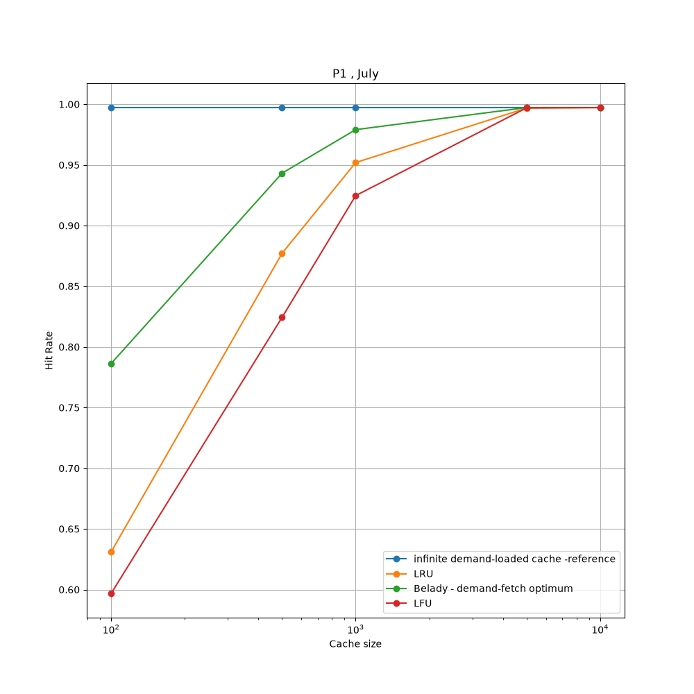

# AUSPEX

Asynchronous predictive prefetching over an LRU-managed cache, evaluated against
standard policies by trace replay on real request logs.

## CHECK DECISIONS.MD FOR PROJECT PROGRESS

## RUN TO REACH CURRENT PROGRESS

```in terminal
make setup 
make data
make stats
make testg
```

## Baseline headroom (Stage 2)



Hit rate (%) on NASA July 1995, protocol P1, batch `2026-09-30T17` at commit
`2695fb3`. Regenerate the plot with `uv run python -m auspex.plots.curves`; the
numbers come from the JSONs in `results/`. July has about 7.2k distinct URLs,
so "% of catalog" = capacity / 7,207.

| capacity | % of catalog | LRU | LFU | Belady — demand-fetch optimum | infinite demand-loaded cache — reference | Belady − LRU (pp) | infinite − LRU (pp) |
|---:|---:|---:|---:|---:|---:|---:|---:|
| 100 | 1.4% | 63.11 | 59.69 | 78.63 | 99.72 | **15.52** | **36.61** |
| 500 | 6.9% | 87.72 | 82.44 | 94.32 | 99.72 | **6.60** | **12.01** |
| 1,000 | 13.9% | 95.19 | 92.47 | 97.90 | 99.72 | 2.71 | 4.53 |
| 5,000 | 69.4% | 99.68 | 99.70 | 99.72 | 99.72 | 0.04 | 0.04 |
| 10,000 | 138.8% | 99.72 | 99.72 | 99.72 | 99.72 | 0.00 | 0.00 |

**Reading it.** When the cache holds less than about 7% of the catalog, LRU leaves
6.6–15.5 pp of hit rate on the table compared with the best possible eviction
policy. At about 14% of the catalog that gap drops below 3 pp, and once most of
the catalog fits, every policy ties. Both reference lines are *demand-fetch*:
neither can avoid a URL's first request, so neither is a ceiling for a prefetcher
(PLAN §5.2). The upper bound for prefetching is the oracle-prefetch bound, built
at the start of Stage 3.

LRU and LFU match libCacheSim exactly at all five sizes; see
`results/libcachesim_crosscheck.md`.

## Data

The NASA-HTTP 1995 traces are **not committed to this repo** — they are 37 MB of
public archive data that anyone can re-fetch. Download them into `data/raw/`:

```commands to download dataset: 
mkdir -p data/raw && cd data/raw
curl -O https://ita.ee.lbl.gov/traces/NASA_access_log_Jul95.gz
curl -O https://ita.ee.lbl.gov/traces/NASA_access_log_Aug95.gz
```

Source: the [Internet Traffic Archive](https://ita.ee.lbl.gov/html/contrib/NASA-HTTP.html)
at Lawrence Berkeley National Laboratory — the canonical origin of this dataset.

Verify what you downloaded:


### Known quirks of these files

Measured, not assumed — see `decisions.md` D008, C002, C003.

- **July covers Jul 1 – Jul 28 only**, not Jul 31. Jul 28 is a half-day, ending
  13:32. Do not hardcode a Jul 29–31 window.
- **July's last line is truncated** (`alyssa.p`, no newline). This is genuine in
  the archive, not a bad download; `wc -l` therefore reports 1,891,714 against a
  true 1,891,715 records. The truncated line is a real malformed record and is
  expected to appear in the parser's dropped count.
- **August starts Aug 1, not Aug 4**, and **Aug 2 is entirely missing** (a
  ~37.7-hour outage from Aug 1 14:52 to Aug 3 04:36).
